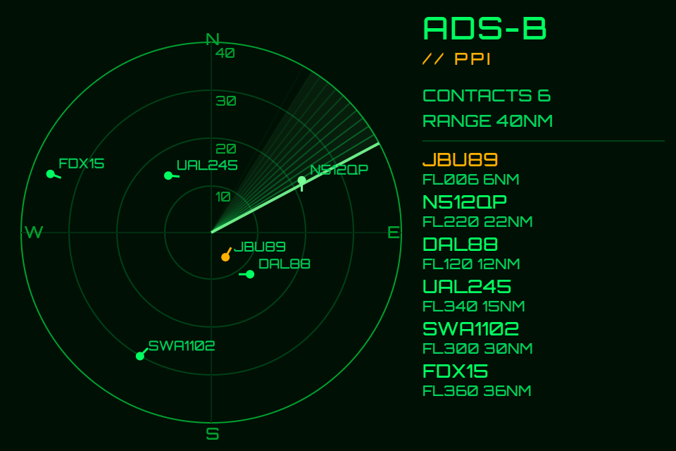

# Cyberdeck Radar Scope

ESP32 radar scope firmware + ADS-B feed tooling.

This repo includes:

1. `main.cpp`: Firmware for the ESP32-3248S035 (3.5" ST7796 CYD) that renders a sweeping radar scope.
2. `radar_feed.py`: Small HTTP service (`/radar`) that converts `aircraft.json` data into a compact payload for the ESP32.
3. `mock_adsb.py`: Local ADS-B emulator for testing without an SDR.
4. `Dockerfile` + `docker-compose.yml`: Containerized runtime for decoder + feed service.
5. `install-adsb.sh`: Raspberry Pi install script for RTL-SDR/readsb + radar feed service.

## ESP32 Firmware

### Configure defaults

Edit the defaults at the top of `main.cpp`:

+ `DEFAULT_WIFI_SSID`
+ `DEFAULT_WIFI_PASS`
+ `DEFAULT_PI_HOST`
+ `DEFAULT_PI_PORT`
+ `DEFAULT_POLL_MS`
+ `DEFAULT_SWEEP_DPS`

### Optional SD config

The firmware can load runtime overrides from SD:

+ `/radar.ini`
+ `/config/radar.ini`
+ `/radar/config.ini`

Expected format:

```ini
WIFI_SSID=MyWiFi
WIFI_PASS=MyPassword
PI_HOST=192.168.1.50
PI_PORT=8090
POLL_MS=2000
SWEEP_DPS=90
FONT_MODE=default
ENABLE_SPRITE_LADDER=0
FONT_MED_CANDIDATES=orbitron_med,orbitron_hero,orbitron_small
FONT_SMALL_CANDIDATES=orbitron_small,orbitron_med,orbitron_hero
```

Keys are `KEY=VALUE`, one per line. Lines starting with `#` or `;` are comments.

Font/sprite options:

+ `FONT_MODE=default|littlefs`
+ `ENABLE_SPRITE_LADDER=0|1` (used only when `FONT_MODE=littlefs`)
+ `FONT_MED_CANDIDATES=fontA,fontB,fontC` (first existing `.vlw` in LittleFS is used for title text)
+ `FONT_SMALL_CANDIDATES=fontA,fontB,fontC` (first existing `.vlw` in LittleFS is used for body text)

SD loading is controlled by `ENABLE_SD_CONFIG` (already enabled in `platformio.ini`).

### Build, flash, monitor

If you use custom TFT_eSPI `.vlw` font files, place them in a `data/` folder and upload LittleFS first:

```bash
pio run -e cyberdeck-radar -t uploadfs
```

Then build, flash, and monitor:

```bash
pio run -e cyberdeck-radar
pio run -e cyberdeck-radar -t upload
pio run -e cyberdeck-radar -t monitor
```

Serial controls:

+ `1` = CLASSIC visual profile
+ `2` = CRT visual profile
+ `3` = FAST visual profile
+ `?` = print help

## Feed Service (`radar_feed.py`)

Runs an HTTP endpoint at `/radar` and emits nearby aircraft with range/bearing from a configured home location.

Environment variables:

+ `HOME_LAT`, `HOME_LON`
+ `MAX_NM`, `MAX_AC`, `MAX_AGE`
+ `SOURCE_URL` (optional remote JSON)
+ `SOURCE_JSON` (local decoder file path)
+ `HOST`, `PORT`

Run directly:

```bash
python3 radar_feed.py
```

Test:

```bash
curl http://localhost:8090/radar
```

## Docker Runtime

Start:

```bash
docker compose up --build -d
```

Verify:

```bash
curl http://localhost:8090/radar
```

Stop:

```bash
docker compose down
```

Notes:

+ `ENABLE_DECODER=1` starts `dump1090-mutability` in-container.
+ `ENABLE_DECODER=0` uses external data via `SOURCE_URL` or `SOURCE_JSON`.
+ USB device passthrough for SDR typically works best on Linux hosts.

## ADS-B Emulator (No SDR)

Start emulator:

```bash
python mock_adsb.py --port 8081 --lat 42.9017 --lon -78.4919 --count 12
```

Use it with Docker feed-only mode:

```yaml
ENABLE_DECODER: "0"
SOURCE_URL: "http://host.docker.internal:8081/aircraft.json"
```

Then:

```bash
docker compose up --build -d
curl http://localhost:8090/radar
```

`mock_adsb.py` also serves `/data/aircraft.json` for tar1090-style path compatibility.

## Raspberry Pi Installer

`install-adsb.sh` installs RTL-SDR Blog V4 drivers, readsb, optional tar1090, and a systemd service for `radar_feed.py`.

Run on the Pi:

```bash
chmod +x install-adsb.sh
sudo ./install-adsb.sh
```

Edit `HOME_LAT` and `HOME_LON` in `install-adsb.sh` before running.
